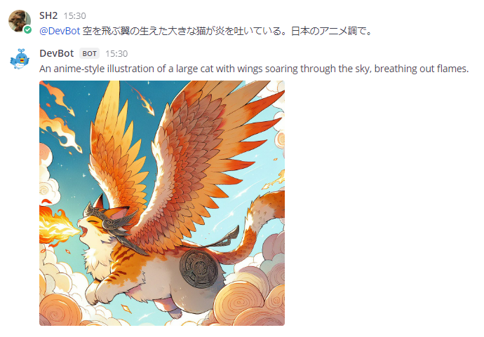

# azure-openai-mattermost-bot

This is a Mattermost Bot that uses Azure OpenAI Service as its backend.

## Setup

First, create a Bot account with Mattermost's integration feature.
The bot's name should begin with "ai-".

The following is the setup procedure for launching Python scripts directly.

```bash
git clone https://github.com/sh2/azure-openai-mattermost-bot.git
cd azure-openai-mattermost-bot/chat-bot
python3 -m venv .venv
source .venv/bin/activate
pip install -r requirements.txt
cp template_script.sh script.sh
vim script.sh
./script.sh
```

The following is the setup instructions for building a Podman/Docker container.

```bash
git clone https://github.com/sh2/azure-openai-mattermost-bot.git
cd azure-openai-mattermost-bot/chat-bot
podman build -t openai-chat-bot .
cp template_container.sh container.sh
vim container.sh
./container.sh
```

## Config

Set the following environment variables.
Please refer to `template_script.sh` and `template_container.sh`.

| Name | Required | Example |
| ---- | ---- | ---- |
| MATTERMOST_URL | yes | <http://mattermost.example.com> |
| MATTERMOST_PORT | yes | 8065 |
| MATTERMOST_API_PATH | yes | /api/v4 |
| BOT_TOKEN | yes | xxxxxxxx |
| AZURE_OPENAI_SERVICE | yes | openai1 |
| AZURE_OPENAI_DEPLOYMENT | yes | deploy1 |
| AZURE_OPENAI_API_VERSION | yes | 2024-06-01 |
| AZURE_OPENAI_API_KEY | yes | yyyyyyyy |
| AZURE_OPENAI_PROXY | no | <http://proxy.example.com:8080> |

If AZURE_OPENAI_SERVICE is undefined, OpenAI API will be used instead of Azure OpenAI Service.
In that case, specify the model name in AZURE_OPENAI_DEPLOYMENT.

## Usage

The bot uses the channel header as a system prompt.
Please edit the header first.

Mention the bot and it will respond with a thread.
If you reply to the thread, you can continue the conversation.
You do not need to re-mention the bot at this time.


## Image Bot

The image-bot directory contains the source code for the image generation bot.
The setup procedure and configurations are the same as for the chat-bot.
When you mentions to the bot, it generates an image and replies.
Unlike chat-bot, it is not possible to continue a conversation in a thread.
Currently only DALL-E 3 model is supported.



## License

MIT License  
Copyright (c) 2023-2024 Sadao Hiratsuka
